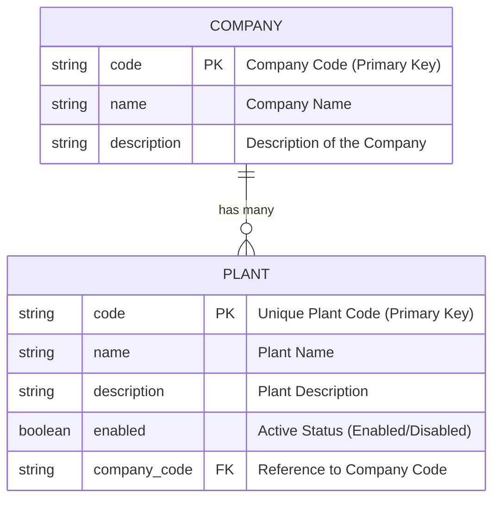
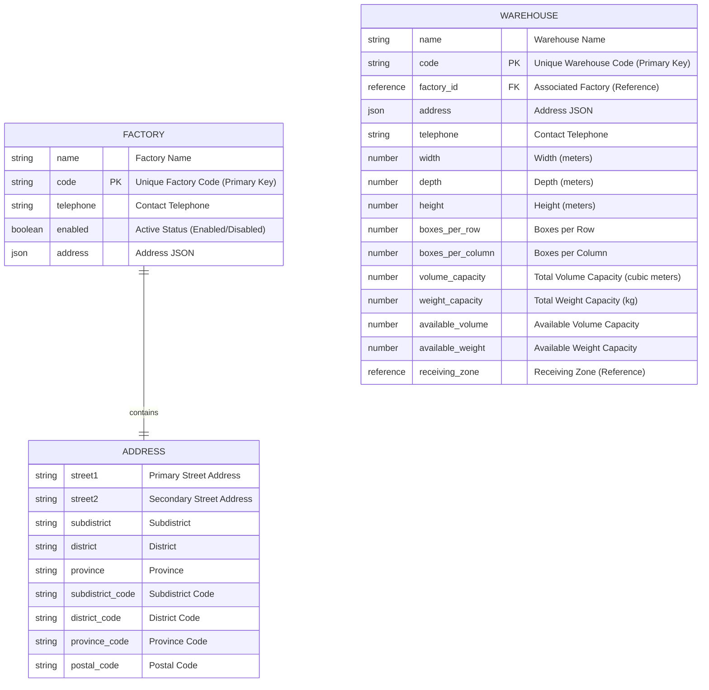

## Company plant

```mermaid
erDiagram
    COMPANY {
        string code PK "Company Code (Primary Key)"
        string name "Company Name"
        string description "Description of the Company"
    }
    
    PLANT {
        string code PK "Unique Plant Code (Primary Key)"
        string name "Plant Name"
        string description "Plant Description"
        boolean enabled "Active Status (Enabled/Disabled)"
        string company_code FK "Reference to Company Code"
    }

    COMPANY ||--o{ PLANT: "has many"

```

## Company plant

```mermaid
erDiagram

    FACTORY {
        string name "Factory Name"
        string code PK "Unique Factory Code (Primary Key)"
        string telephone "Contact Telephone"
        boolean enabled "Active Status (Enabled/Disabled)"
        json address "Address JSON"
    }

    ADDRESS {
        string street1 "Primary Street Address"
        string street2 "Secondary Street Address"
        string subdistrict "Subdistrict"
        string district "District"
        string province "Province"
        string subdistrict_code "Subdistrict Code"
        string district_code "District Code"
        string province_code "Province Code"
        string postal_code "Postal Code"
    }

    FACTORY ||--|| ADDRESS: "contains"

   WAREHOUSE {
        string name "Warehouse Name"
        string code PK "Unique Warehouse Code (Primary Key)"
        reference factory_id FK "Associated Factory (Reference)"
        json address "Address JSON"
        string telephone "Contact Telephone"
        number width "Width (meters)"
        number depth "Depth (meters)"
        number height "Height (meters)"
        number boxes_per_row "Boxes per Row"
        number boxes_per_column "Boxes per Column"
        number volume_capacity "Total Volume Capacity (cubic meters)"
        number weight_capacity "Total Weight Capacity (kg)"
        number available_volume "Available Volume Capacity"
        number available_weight "Available Weight Capacity"
        reference receiving_zone "Receiving Zone (Reference)"
    } 
```