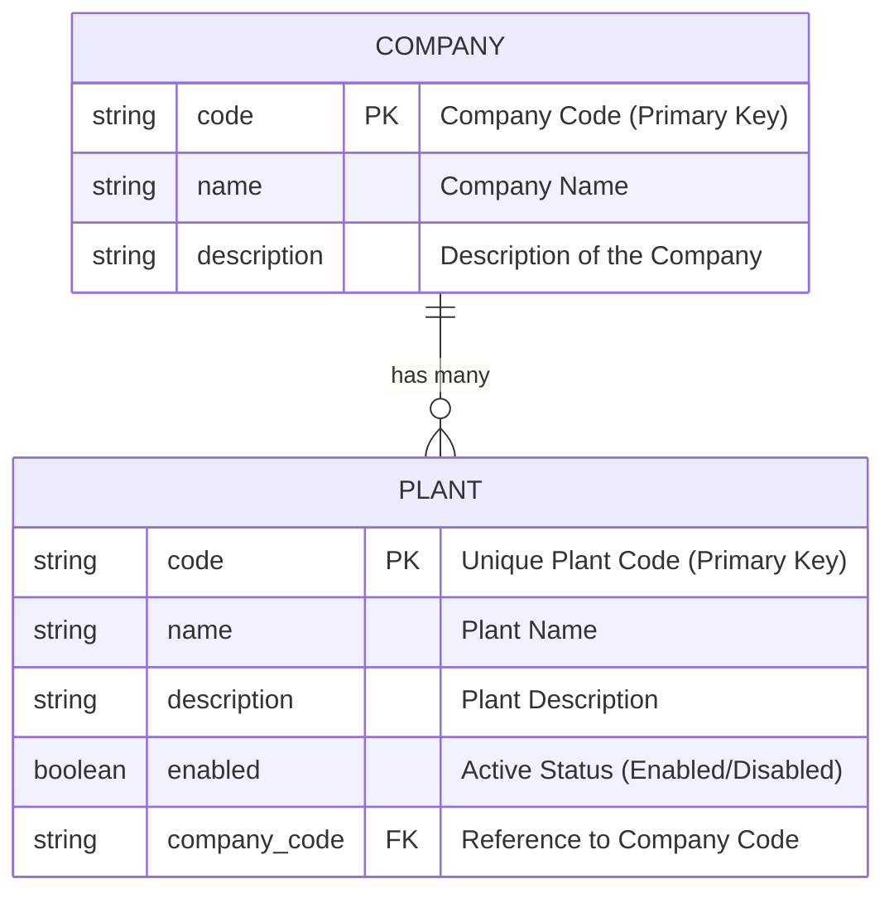
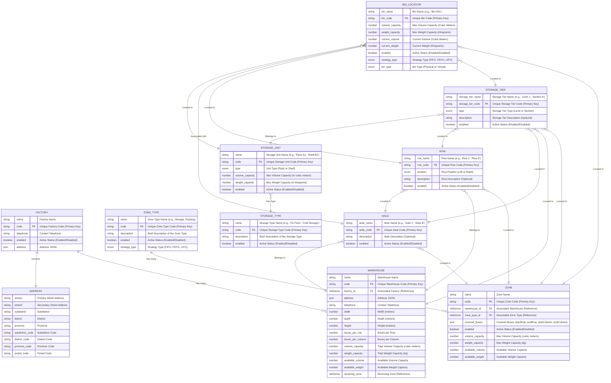

## Company plant

```mermaid
erDiagram
    COMPANY {
        string code PK "Company Code (Primary Key)"
        string name "Company Name"
        string description "Description of the Company"
    }
    
    PLANT {
        string code PK "Unique Plant Code (Primary Key)"
        string name "Plant Name"
        string description "Plant Description"
        boolean enabled "Active Status (Enabled/Disabled)"
        string company_code FK "Reference to Company Code"
    }

    COMPANY ||--o{ PLANT: "has many"

```

## Company plant

```mermaid
erDiagram

    FACTORY {
        string name "Factory Name"
        string code PK "Unique Factory Code (Primary Key)"
        string telephone "Contact Telephone"
        boolean enabled "Active Status (Enabled/Disabled)"
        json address "Address JSON"
    }

    ADDRESS {
        string street1 "Primary Street Address"
        string street2 "Secondary Street Address"
        string subdistrict "Subdistrict"
        string district "District"
        string province "Province"
        string subdistrict_code "Subdistrict Code"
        string district_code "District Code"
        string province_code "Province Code"
        string postal_code "Postal Code"
    }

    FACTORY ||--|| ADDRESS: "contains"

   WAREHOUSE {
        string name "Warehouse Name"
        string code PK "Unique Warehouse Code (Primary Key)"
        reference factory_id FK "Associated Factory (Reference)"
        json address "Address JSON"
        string telephone "Contact Telephone"
        number width "Width (meters)"
        number depth "Depth (meters)"
        number height "Height (meters)"
        number boxes_per_row "Boxes per Row"
        number boxes_per_column "Boxes per Column"
        number volume_capacity "Total Volume Capacity (cubic meters)"
        number weight_capacity "Total Weight Capacity (kg)"
        number available_volume "Available Volume Capacity"
        number available_weight "Available Weight Capacity"
        reference receiving_zone "Receiving Zone (Reference)"
    } 

    FACTORY ||--o{ WAREHOUSE: "has many"

    ZONE_TYPE {
        string name "Zone Type Name (e.g., Storage, Packing)"
        string code PK "Unique Zone Type Code (Primary Key)"
        string description "Brief Description of the Zone Type"
        boolean enabled "Active Status (Enabled/Disabled)"
        enum strategy_type "Strategy Type (FIFO, FEFO, LIFO)"
    }

    ZONE {
        string name "Zone Name"
        string code PK "Unique Zone Code (Primary Key)"
        reference warehouse_id FK "Associated Warehouse (Reference)"
        reference zone_type_id FK "Associated Zone Type (Reference)"
        json covered_boxes "Covered Boxes (startRow, endRow, startColumn, endColumn)"
        boolean enabled "Active Status (Enabled/Disabled)"
        number volume_capacity "Max Volume Capacity (cubic meters)"
        number weight_capacity "Max Weight Capacity (kg)"
        number available_volume "Available Volume Capacity"
        number available_weight "Available Weight Capacity"
    }

    ZONE_TYPE ||--o{ ZONE: "has many"

    STORAGE_TYPE {
        string name "Storage Type Name (e.g., 'On Floor', 'Cold Storage')"
        string code PK "Unique Storage Type Code (Primary Key)"
        string description "Brief Description of the Storage Type"
        boolean enabled "Active Status (Enabled/Disabled)"
    }

    STORAGE_UNIT {
        string name "Storage Unit Name (e.g., 'Rack A1', 'Shelf B2')"
        string code PK "Unique Storage Unit Code (Primary Key)"
        enum type "Unit Type (Rack or Shelf)"
        number volume_capacity "Max Volume Capacity (in cubic meters)"
        number weight_capacity "Max Weight Capacity (in kilograms)"
        boolean enabled "Active Status (Enabled/Disabled)"
    }
    STORAGE_UNIT }o--|| STORAGE_TYPE: "Has Type"
    
    AISLE {
        string aisle_name "Aisle Name (e.g., 'Aisle 1', 'Aisle B')"
        string aisle_code PK "Unique Aisle Code (Primary Key)"
        string description "Aisle Description (Optional)"
        boolean enabled "Active Status (Enabled/Disabled)"
    }

    AISLE }o--|| WAREHOUSE: "Belongs to"
    AISLE }o--|| ZONE: "Located in"

    ROW {
        string row_name "Row Name (e.g., 'Row 1', 'Row A')"
        string row_code PK "Unique Row Code (Primary Key)"
        enum position "Row Position (Left or Right)"
        string description "Row Description (Optional)"
        boolean enabled "Active Status (Enabled/Disabled)"
    }

    ROW }o--|| AISLE: "Located in"
    ROW }o--|| WAREHOUSE: "Belongs to"
    ROW }o--|| ZONE: "Located in"

    STORAGE_TIER {
        string storage_tier_name "Storage Tier Name (e.g., 'Level 1', 'Section A')"
        string storage_tier_code PK "Unique Storage Tier Code (Primary Key)"
        enum type "Storage Tier Type (Level or Section)"
        string description "Storage Tier Description (Optional)"
        boolean enabled "Active Status (Enabled/Disabled)"
    }
    STORAGE_TIER }o--|| STORAGE_UNIT: "Belongs to"
    STORAGE_TIER }o--|| ROW: "Located in"
    STORAGE_TIER }o--|| AISLE: "Located in"
    STORAGE_TIER }o--|| WAREHOUSE: "Located in"
    STORAGE_TIER }o--|| ZONE: "Located in"

    BIN_LOCATION {
        string bin_name "Bin Name (e.g., 'Bin 001')"
        string bin_code PK "Unique Bin Code (Primary Key)"
        number volume_capacity "Max Volume Capacity (Cubic Meters)"
        number weight_capacity "Max Weight Capacity (Kilograms)"
        number current_volume "Current Volume (Cubic Meters)"
        number current_weight "Current Weight (Kilograms)"
        boolean enabled "Active Status (Enabled/Disabled)"
        enum strategy_type "Strategy Type (FIFO, FEFO, LIFO)"
        enum bin_type "Bin Type (Physical or Virtual)"
    }
    BIN_LOCATION }o--|| STORAGE_UNIT: "Located in"
    BIN_LOCATION }o--|| AISLE: "Associated with"
    BIN_LOCATION }o--|| ROW: "Located in"
    BIN_LOCATION }o--|| STORAGE_TIER: "Located in"
    BIN_LOCATION }o--|| ZONE: "Located in"

```