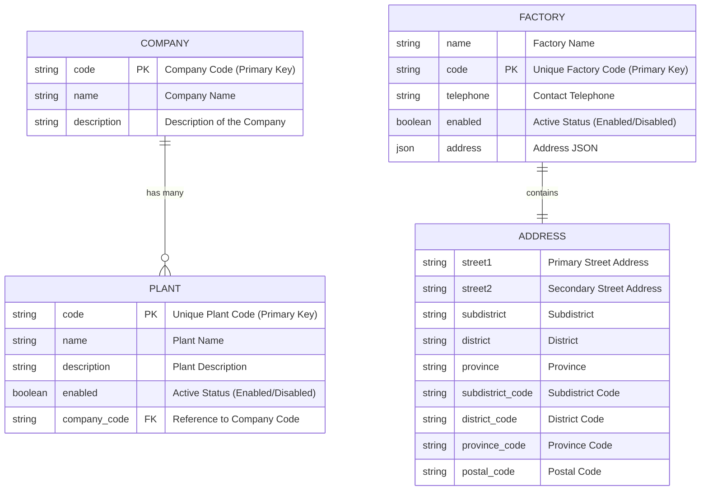

## Demo Case | Sequence Diagram

```mermaid
erDiagram
    COMPANY {
        string code PK "Company Code (Primary Key)"
        string name "Company Name"
        string description "Description of the Company"
    }
    
    PLANT {
        string code PK "Unique Plant Code (Primary Key)"
        string name "Plant Name"
        string description "Plant Description"
        boolean enabled "Active Status (Enabled/Disabled)"
        string company_code FK "Reference to Company Code"
    }

    COMPANY ||--o{ PLANT: "has many"

    FACTORY {
        string name "Factory Name"
        string code PK "Unique Factory Code (Primary Key)"
        string telephone "Contact Telephone"
        boolean enabled "Active Status (Enabled/Disabled)"
        json address "Address JSON"
    }

    ADDRESS {
        string street1 "Primary Street Address"
        string street2 "Secondary Street Address"
        string subdistrict "Subdistrict"
        string district "District"
        string province "Province"
        string subdistrict_code "Subdistrict Code"
        string district_code "District Code"
        string province_code "Province Code"
        string postal_code "Postal Code"
    }

    FACTORY ||--|| ADDRESS: "contains"
```

